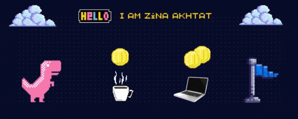

  

 

<pre>
══════════════════════════════════════════════════════════════════════════════════════
     Full-Stack Developer   |  Modern Design Lover |   DevOps & Automation Explorer
══════════════════════════════════════════════════════════════════════════════════════
</pre>
  

    
    
    
  

<h3 align="center">
  
  A little more about me...
</h3>
 

> 🎓 I’m a final-year Computer Engineering student specializing in Full-Stack Development

> 🎯 Actively seeking a final-year internship in Full-Stack Web Development

> 🌱 Currently exploring the world of DevOps and automation to strengthen my development workflow

> 💡 Passionate about building secure, high-performance, and user-friendly web applications

> 🎨 I also love modern UI/UX design and strive to create visually appealing interfaces

